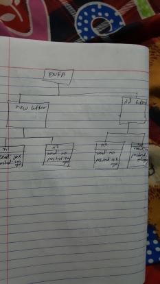

# Research Records - Session 02

## Interaction

# Why do we need System Architecture?
    A basis for communication: software architecture is a sort of plan of the   system and is primordial for the understanding,
    the negotiation and the communication between all the stakeholders (user side, customer, management, etc.). In fact, it makes
    it easier to understand the whole system and therefore makes the decisions process more efficient.

    The earliest decisions: the first decisions taken are at this stage. Those early decisions have a huge importance on the 
    rest of the project and become very difficult to change the more we advance in the process.

    Transferability of the model: software architecture defines the model of the software and how it will function. 
    Having it makes it possible to reuse this model for other softwares; code can be reused as well as the requirements.
    All the experience we get while doing that architecture is also transferred. This mean that we know and can reuse 
    the consequences of the early decisions we took on the first place. 
[source]https://apiumhub.com/tech-blog-barcelona/importance-good-software-architecture#:~:text=Here%20are%20the%20three%20main%20reasons%20why%20a,all%20the%20stakeholders%20%28user%20side%2C%20customer%2C%20management%2C%20etc.%29.

# Draw an object diagram for the following situation (for 5min)
 
 The Estonian News Fetcher Application (ENFA) has a buffer that has already
 two old news-items in it – one is 2h old the other 3h. It also has a buffer with
 new news items (we assume there are 3 new news items). Each news item
 has content connected to it (be creative about the actual content).The new
 news items have been read 1 min, 2 min, and 2.5 min ago.
 Show the time relation in the different buffers with an association.
 
    

# Object Diagram
    An object diagram shows a partial or complete view of the objects that exist at a given point in time
    and the relationships between the objects. An object diagram is more concrete than a class diagram and 
    thus serves as a snapshot of the system, an example that adds to the conceptual understanding of the design.
    The diagram also serves the designers in identifying the concrete classes.
[source] Object-Oriented Analysis, Design and Implementation - Brahma Dathan, Sarnath Ramnath, 2nd ed. 2015 - 978-3-319-24280-4.pdf chapter 13 page 449

    
    [image](/Rabindra/Reflections/images/ClassDiagram_and_object_diagram.jpg)

# Pros of Object diagram based on movie
    1. It can be used for making the prototype of a system.
    2. It is used for small parts of the system.
    3. It is easy to change the size or scope of an object diagram.
    4. It can be used in different test cases.
    5. It is easy to understand and use.

# Cons of Object diagram based on movie
    1. It should be maintained and reviewed regularly according to changes in the code.
    2. It may become outdated easily if maintenance or change management processes are immature.
    3. Some critical features and relations between classes may be missed during implementation due to
       limited presentation by given diagram.
    4. In large systems, object diagrams become excessive and not readable.
    5. It is challenging and more costly to refactor continuously.
    6. Model code gap.
   

   
