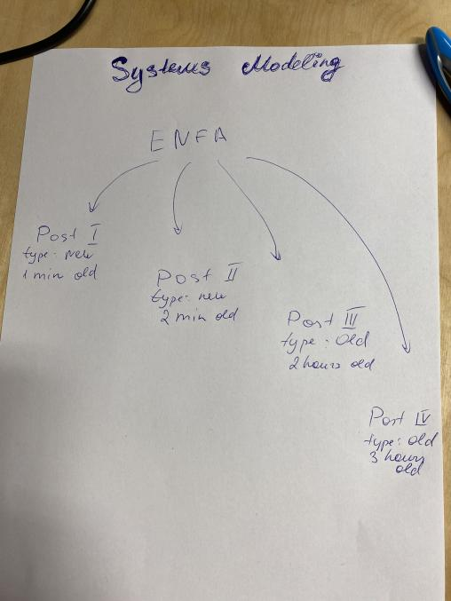

# Lecture 2 homework

## Object diagram movie
#### 1. Object diagram pros  
- System architecture visualization and control.
- Promote a deeper understanding of the system, opening up opportunities for simplification and reuse.
- Easy to visualise and change dependencies

#### 2. Object diagram cons  
- It can be costly to participate in the pre-collection of requirements
- Huge and complex symbols3. Makes sense  

#### 4. Doesn't make sense   
What to do if the project consists of 20 or 30 different interfaces that somehow touch each other

#### 5. Movie Thoughts  
Pro movie: Simple and understandable 
Con movie: Will be more pictures

# Lecture 2 lecture work 

#### Why we need a software acritecture
We need softrware acritecture to have a success project,that easy to develop in future. To make the understandable and easy to use structure of the system
 
#### Draw an object diagram for the following situation (for 5min)
 
 The Estonian News Fetcher Application (ENFA) has a buffer that has already
 two old news-items in it – one is 2h old the other 3h. It also has a buffer with
 new news items (we assume there are 3 new news items). Each news item
 has content connected to it (be creative about the actual content).The new
 news items have been read 1 min, 2 min, and 2.5 min ago.
 Show the time relation in the different buffers with an association.

## Breakout A

### Opening Notes
So in this discussion we will write pros and cons about Object Diagrams.

### First Person Pro Notes
Good way to start out before writing the code.
### Second Person Con Notes
Inefficient because it can become really messy very fast.
### Third Person Pro Notes
Object diagrams are easy to understand for both professionals and stakeholders.
### Fourth Person Con Notes
It only focuses on a particular instance of a class.
### Moderator Summary Notes
So now let's challenge each other about our points.

### Round 1 Person Challenge/Question Notes
Object diagrams can become complex because of their user-friendly character since it has all-inclusive descriptions.
### Round 1 Person Comment/Defense/Answer Notes
Well what i meant is that object diagrams usually include everything about the project. Its simple to manage it for small projects
### Round 2 Person Challenge/Question Notes
Object diagrams are static instead of being a dynamic view.
### Round 2 Person Comment/Defense/Answer Notes
Sometimes in some circumstances it is useful to have a static fixed state of the system.
### Round 3 Person Challenge/Question Notes
How does changing a particular aspect of a diagram affect development?
### Round 3 Person Comment/Defense/Answer Notes
Well, in order to have flexible we should be ready to change our system whenever needed. Of course for object diagrams it will take a bit more time but it is always possible.

### Free discussion to find best points for and against
Please fill general notes during discussion here

### 2 Best For
Point 1 for Object diagrams are easy to understand for both professionals and stakeholders.

Point 2 for Good way to start out before writing the code
### 2 Best Against
Point 1 against Inefficient because it's can become really messy very fast

Point 1 against It only focuses on a particular instance of a class.

