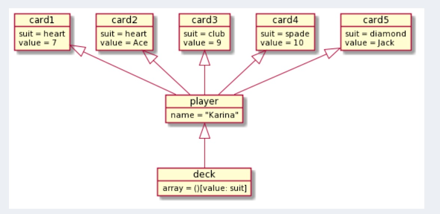
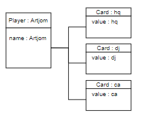
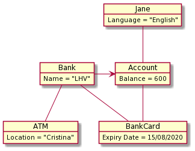
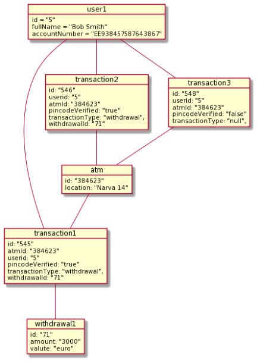

# Lecture 3 homework

## Lecture task 1: Curiosities in Object Diagrams

### Mark what you think is strange in the following diagram 1

- associations
- attributes - Array in deck. This array break all logic of diagramm

### Mark what you think is strange in the following diagram 2

 - object names - value is in the object name. So object name combine with class name and value. Better to use small laters 

### Mark what you think is strange in the following diagram 3

- associations - connecton between Bank and Account  is wrong
- object names - Better to use small laters 

### Mark what you think is strange in the following diagram 4

- attributes - ID is not nessesary for diagramms, it is needed for databases

## Breakout A

Notes for Group Nr 6
Moderator: Jonathan Räni
Note-Taker: Raigo Kõvask
Opening Notes

First Jonathan gave everyone some time to prepare and then started to pick randomly people who are going to give pros and cons.

### First Person Pro Notes 
 - It's easier to understand the system design. Thanks to class diagrams we can implement software design patterns to a system. It is really hard to do it just by coding because some people can’t imagine how the system is going to work.
### Second Person Con Notes 
 - Complicated relations make it hard to understand the diagram and it is easy to mix up relationship arrows.
### Third Person Pro Notes 
 - You can use class diagrams as a base for other diagrams.
### Fourth Person Con Notes 
 - It can take time for the developer to understand and to maintain it.
### FIfth Person Pro Notes
 - Good way to illustrate a system structure with a maximum information (very detailed)
### Sixth Person Con Notes 
 - Class diagram focuses on a static view of the system. Both designers and newcomers to the project will probably learn more from diagrams that focus on the behaviour, for instance state-diagrams or sequence-diagrams.
### Seventh Person Pro Notes
 - It’s easy to maintain at some point. Easy to add new classes, easy to modify attributes of classes.
### Moderator Summary Notes
 - Everybody was prepared and presented their arguments very well.
Note taker worked very efficiently.
### Round 1 Person Challenge/Question Notes
 - If the system is complicated and huge then it's not easy to understand.
### Round 1 Person Comment/Defense/Answer Notes
 - We can use design patterns to cope with the project.
### Round 2 Person Challenge/Question Notes
 - If you understand the cardinalities then it’s not that complicated.
### Round 2 Person Comment/Defense/Answer Notes
 - If you show this diagram to business people, who do not use this so often, then they can interpret it in a wrong way and for them is it worth the time to learn all the different types of relationships and the lines.
### Round 3 Person Challenge/Question Notes
 - Why not just skip it and use another diagram
### Round 3 Person Comment/Defense/Answer Notes
 - It's easier to make a class diagram for visualizing.

### Free discussion to find best points for and against
 - Since we had more time then we discussed more pros and cons:
    Good way to illustrate a system structure with a maximum information (very detailed)

    Class diagram focuses on a static view of the system. Both designers and newcomers to the project will probably learn more from diagrams that focus on the behaviour, for instance state-diagrams or sequence-diagrams.
### 2 Best For
 - Point 1: First Person Pro Notes’s argument
 - Point 2: Third Person Pro Notes’s argument
### 2 Best Against
 - Point 1: Sixth Person Con Notes’s argument
 - Point 2: Fourth Person Con Notes’s argument

