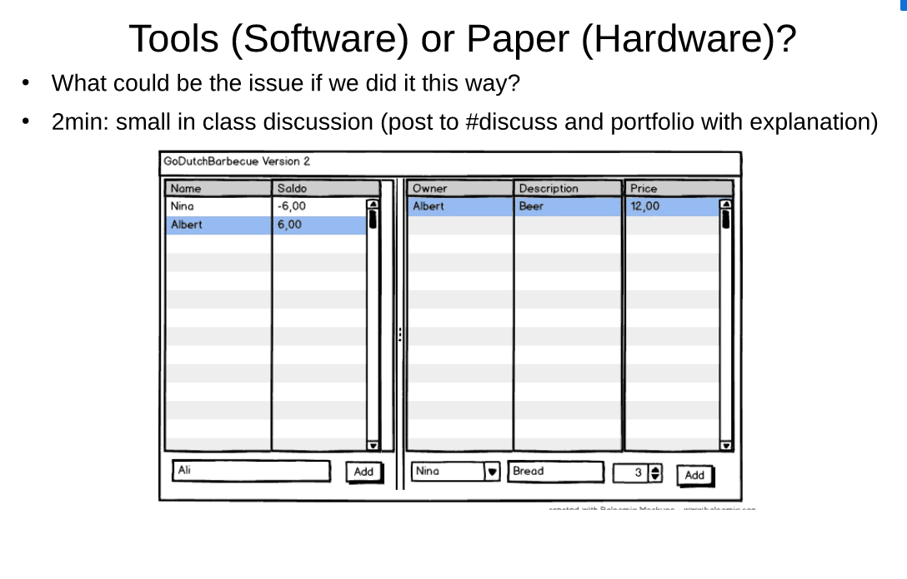

# Lecture 6

### Lecture

##### Communication with Customer/End-user is usually hard for Requirements Engineering
Why other methods and/or artifacts could help ? 
Manuals, documentations, demos, interfaces and mock classes, prototypes 

##### Props and Cons of using tools (Software) and Paper(Hardware)? 

Paper is very easy to use and paper is easy for quickly brainstorming new ideas.
It all the time is available. 

Tools are easy to read and understand. You can have interaction on the tools. 
Software is more professional and can easily share

## Breakout

###  Opening Notes
We will discuss sequence diagrams. Our discussion group members are :

###  First Person Pro Notes
In sequence diagram you can describe how the system work with different objects. Use sequence diagrams when you want to look at the behavior of multiple objects within a single use case. 
 
###  Second Person Con Notes
Sequence diagrams are good for representing the interactions of objects, but not very well suited for pinpointing behavior.
###  Third Person Pro Notes
sequence diagrams help discover architectural, interface and logic problems early on in the design process. It is possible to validate your architecture, interfaces, state machine and logic by seeing how the system architecture would handle different basic scenarios and special cases. That's especially good for systems involving the interaction of components that are being implemented in parallel by different teams.
###  Fourth Person Con Notes
Consumes a lot horizontal space. You need to extend diagram to the right every time you adding new object.
Moderator 
###  Summary Notes
Regarding pros, its easy to represent how the objects withing our system are connected between them, as well as how are they connected with objects from other systems.
As per cons, sequence diagrams take too much horizontal space so can get too inconvenient in big systems.

###  Round 1 Person Challenge/Question Notes
If something goes wrong in system does it make any sense to describe sequence diagram
###  Round 1 Person Comment/Defense/Answer Notes
The diagram should describe the system that works fine
###  Round 2 Person Challenge/Question Notes
A note about the second con, the fact that it takes too much space horizontally might not be an actual con of the diagram but rather just a question of a good diagram designer
###  Round 2 Person Comment/Defense/Answer Notes
It is not really a problem, its just an issue of the design
###  Round 3 Person Challenge/Question Notes

###  Round 3 Person Comment/Defense/Answer Notes
zzz

###  Free discussion to find best points for and against
Additional question: How are sequence diagrams and use cases related?

A: People usually create one sequence diagram for one use case. Sequence diagrams can show the order of actions when a user interacts with the system. 

###  2 Best For
Point 1: In sequence diagram you can describe how the system work with different objects. Use sequence diagrams when you want to look at the behavior of multiple objects within a single use case. 
Point 2: sequence diagrams help discover architectural, interface and logic problems early on in the design process. It is possible to validate your architecture, interfaces, state machine and logic by seeing how the system architecture would handle different basic scenarios and special cases. That's especially good for systems involving the interaction of components that are being implemented in parallel by different teams.

###  2 Best Against
Point 1: Too much space in big systems
Point 2: SD are difficult to understand and prior syntactical knowledge is needed to fully understand them . So written text or code blocks are more appropriate to explain use case scenarios than sequence diagrams

[Sergei Eensalu README](/Sergei%20Eensalu/README.md)
