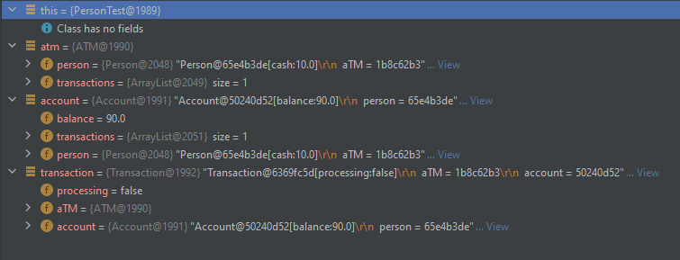

# ATM Money Withdrawal Code Generation
* Initial state

* Object state

[Umple generated java file](../Sander%20Jenk/umpleAtm.java)  
[Umple class diagram source file](../Sander%20Jenk/umpleAtm.txt)

# Mancala Code Generation
The following object diagrams are created according to the first scenario from Exercise 2.1.3 from lab 2.

* Initial states

* Object states

# More Code Generation
Generated the code based on Mancala Network game class diagram of lab 3.

Generated the class diagram using Visual Paradigm desktop version.

The generated code is in  More Code Generation folder.

# Component Diagram Mancala Network Game
Done by visual-paradigm desktop version 

1. High level view stressing the network connectivity and app running on a phone.

2. Detail view of just the server part of the game.

# Component Diagrams ATM Money Withdrawal

Done by  https://online.visual-paradigm.com/drive/#diagramlist:proj=0&new=ComponentDiagram

1. High level overview of the atm machine software embedded in its relevant bank ecosystem (for example account management, transaction log, software updater, monitoring, and maintenance running in a secure cloud environment of the bank operating the ATM).

2. Detailed overview of the software running on the ATM also operating the hardware of the actual cash dispenser and card reader.

