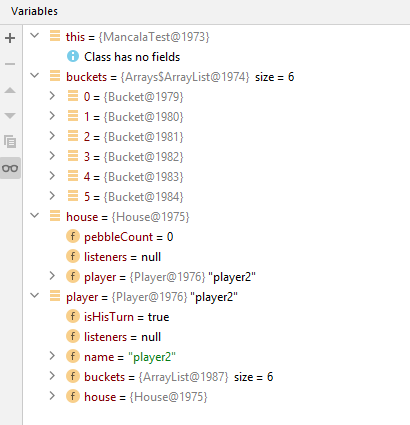
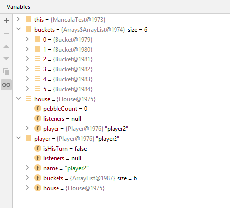

# ATM Money Withdrawal Code Generation
* Initial state

* Object state

# Mancala Code Generation
The following object diagrams are created according to the first scenario from Exercise 2.1.3 from lab 2.

* Initial states

* Object states

