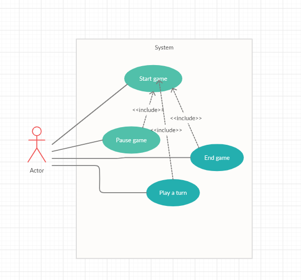
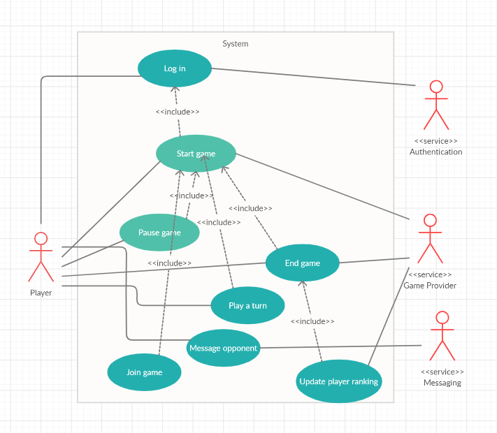
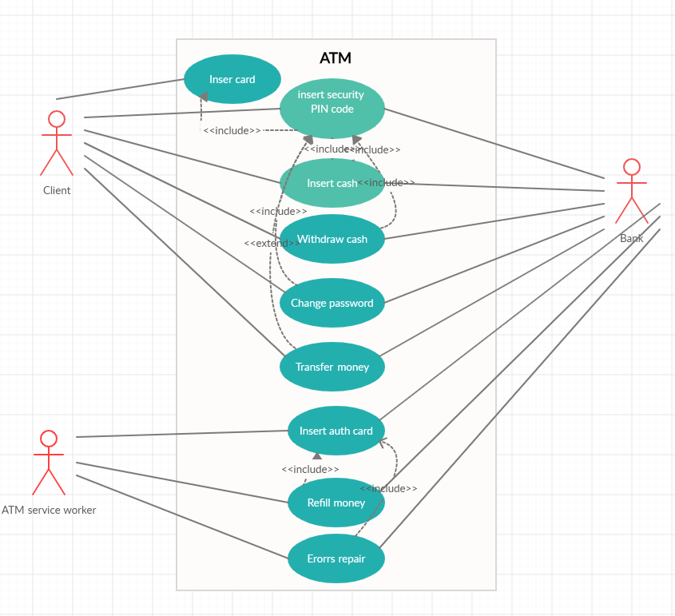
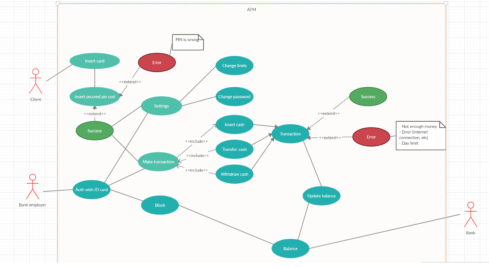

# Building a Search Engine

# Mancala Usecase Diagrams

High-level diagram:

Low-level diagram:

In team discussion we reached the conclusion that the low-level use-case diagram
could be helpful for development but when choosing between this and a
respective component diagram, the latter might be more suitable for development purposes.
However, for initial design decisions, use case diagrams are a good starting point.

# Mancala personas

## Helmut, the casual social player

### Profile
Helmut is a 32-year old man living in Põlva and has recently relocated there and has not made a lot of friends yet. He likes puzzle games and having a few beers in the evening.
### Motivations
Helmut likes playing puzzle games on Miniclip, but enjoys the social aspect of online gaming the most. Games can only stimulate Helmut for so long before it gets boring. Politely trash talking the opponent and finding excuses when losing brings extra excitement for Helmut and keeps him engaged for longer.

## Joosep, the child entertaining himself when parents aren't home yet

### Profile
Joosep is a 11-year old child who has a few hours of free time after school when his parents aren't home yet. He likes playing RuneScape and other online games. His favourite class in school is math and lately he's been interested in math based games.
### Motivations
Joosep has not been paying much attention in English class, so he does not understand languages other than Estonian. He finds it hard to navigate menus in games that are only available in English. He also likes to sing his favourite songs to his opponents.

## Changes made based on personas
Based on Helmut's preferences, we decided to add a messaging service to the game, which allows you to speak to your opponent. Based on Joosep's motivations, we decided to make the menus as intuitive as possible so that non-English speaking players can play without any problems. We also decided to add an option to mute the opponent because of Joosep's singing tendencies. 

# ATM Money Withdrawal Usecase

High-level diagram: 

Low-level diagram:

In team discussion we reached the conclusion that the low-level use-case diagram
could be helpful for development but when choosing between this and a
respective component diagram, the latter might be more suitable for development purposes.
However, for initial design decisions, use case diagrams are a good starting point.