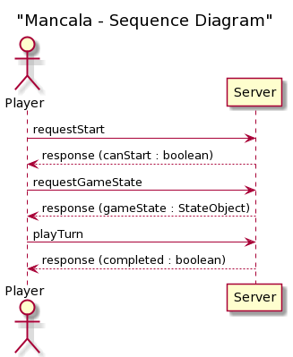
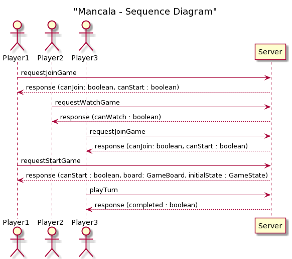
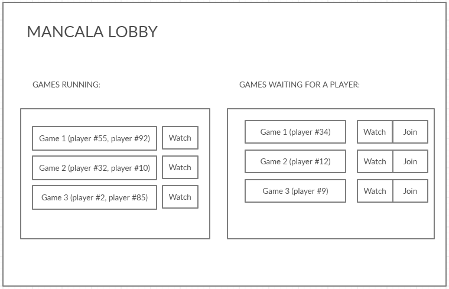
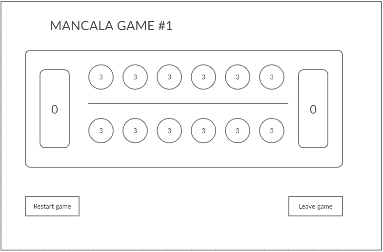
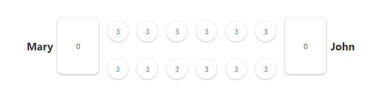
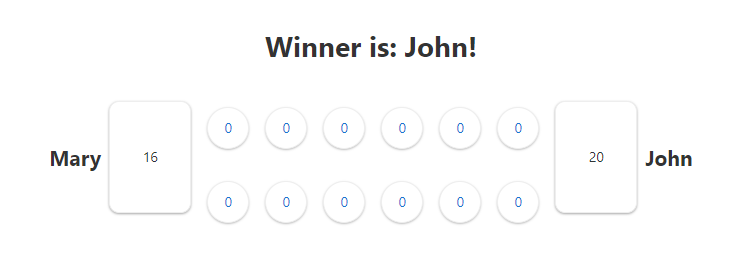

# Mancala Sequence Diagrams

1. Waiting for your turn scenario:


2. Game lobby - start game when two players are ready to play
scenario:



# Mancala Wireframes

Connecting to the server:

In the lobby:



Start of the game:



The first few moves of gameplay:


End of the game:


# Mancala GUI
Start of the game:  
  
End of the game  
  


Gui was made with angular and it is totally an overkill for this task. If you want to run it yourself then you have to run Mancala Controller and Tests java project and angular project in mancala_angular folder.   
```npm install``` for installation of packages and ```ng serve``` for running the angular app (might need Angular CLI but dunno)