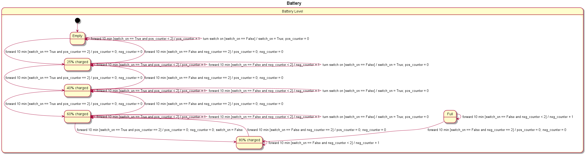

# Statechart and model checking
The state chart of battery conditioning, written originally
as a yaml file and exported to PlantUML via Sismic:

Note that the only transitions in our state chart are 'turn switch on', and 'forward 10 min',
since we did not fully comprehend the meaning of setting laptop active or inactive.
The code is located in the diy_model_checker directory (battery.yaml, main.py). 
We did not finish the third subtask due to time constraints. The experiments we did
with reachability checking are visible in main.py.